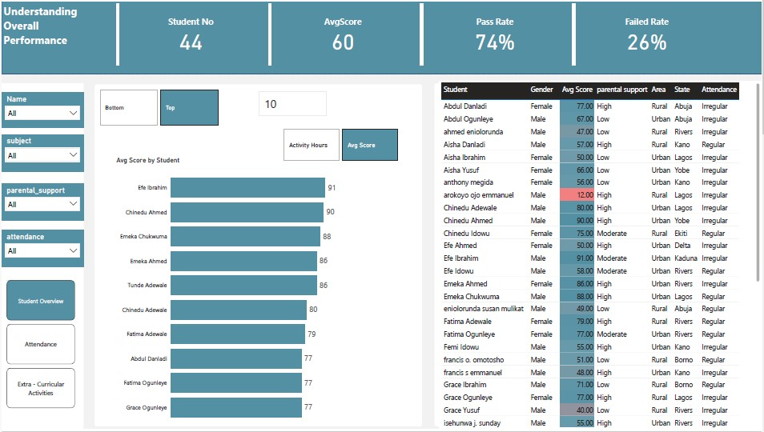
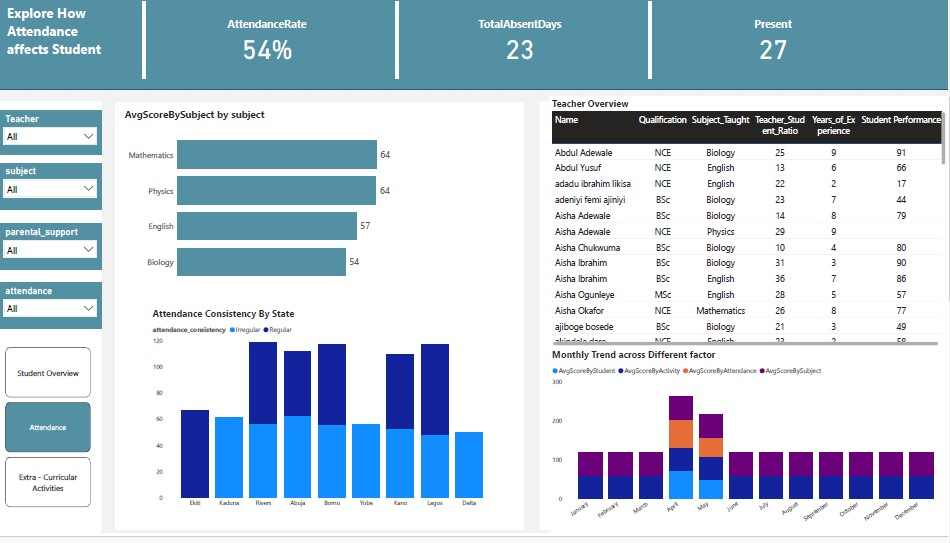
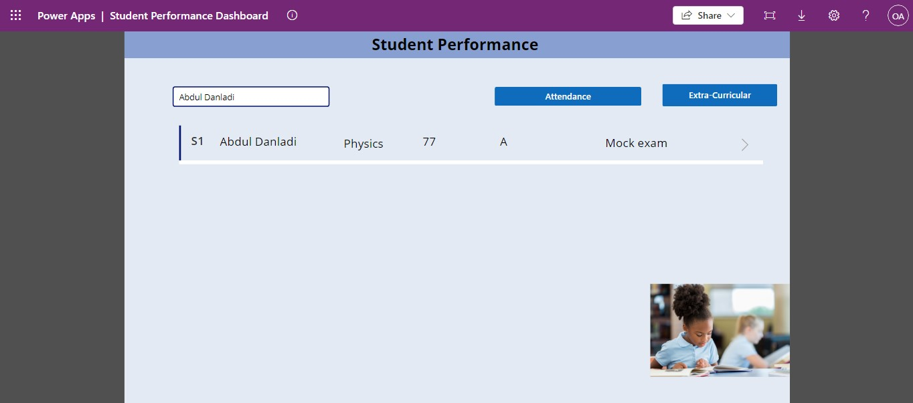
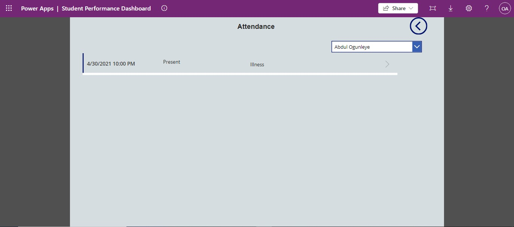

# DFA2024-Datathon

## Dominion DFA Team 

### Hackathon Project Report: Improving Student Performance Using Data

#### **1. Introduction**
This project aims to identify key factors that influence student performance in final exams like JAMB and WASSCE. By analyzing various aspects of student activity, attendance, and extracurricular involvement, we provide actionable insights that schools can use to improve their outcomes.

#### **2. Data Collection**
We gathered data from multiple sources, including student records, attendance logs, and extracurricular activities. This data includes variables such as:
- **Student information**: ID, gender, state, parental support, etc.
- **Performance records**: Exam scores by subject.
- **Attendance records**: Presence and absence patterns.
- **Extracurricular activity records**: Types of activities, hours spent, etc.

The data was collected using survey methods and institutional databases provided by participating schools.

#### **3. Data Loading and Database Schema**
The collected data was loaded into a PostgreSQL database, where a relational schema was designed to handle the different tables:
- **Table 1**: `Student Information` – includes demographics, parental support, and background information.
- **Table 2**: `Performance Records` – contains the exam scores for each student by subject.
- **Table 3**: `Attendance Records` – logs student attendance data.
- **Table 4**: `Extracurricular Activities` – logs details on student participation in activities.
  

#### **4. Predictive Analysis**
To better understand the influence of various factors, we performed predictive analysis using machine learning techniques. The goal was to predict student success based on their attendance, parental support, and extracurricular activity participation.

- **Model used**: Random Forest Classifier (You can specify the model used)
- **Key Features**: Attendance rate, parental support level, extracurricular activity involvement.
- **Performance metrics**: Accuracy, precision, and recall (or any other relevant metrics based on your work).

**Link to the model** : [Here](https://github.com/JoshuaPaul-lasisi/DataFest)

#### **5. Power BI Analysis**
We connected Power BI to the PostgreSQL database to perform an in-depth analysis. The insights were visualized in a 3-page Power BI report to highlight factors affecting student performance:

1. **Overall Student Performance**:
   - **KPIs**: Total number of students, average score, pass/fail rate.
   - **Filters**: Name, subject, parental support, attendance.
   - **Insights**: The highest and lowest scoring students, the effect of parental support on performance.

   

2. **Impact of Attendance**:
   - **KPIs**: Attendance rate, total absent days, number of students present.
   - **Visualizations**: Attendance consistency by state, average score by subject.
   - **Insights**: How attendance affects overall student performance across different regions and subjects.

   

3. **Impact of Extracurricular Activities**:
   - **KPIs**: Number of students by activity type, impact of activities on academic performance.
   - **Visualizations**: Extra-curricular activities by average score, activity participation by region.
   - **Insights**: Which activities contribute positively or negatively to academic performance, as well as patterns in participation across different regions.

   **Link to Live Power BI Report**: [Power BI Report](https://app.powerbi.com/view?r=eyJrIjoiYWZiMDc2YzAtYWU3OC00YzdhLWFkMjMtNjNlYjQ0NjA4YjczIiwidCI6ImRmODY3OWNkLWE4MGUtNDVkOC05OWFjLWM4M2VkN2ZmOTVhMCJ9).

#### **6. PowerApps Solution**
To make the data more accessible and usable by school staff, a PowerApps canvas application was developed. The app allows users to:
- **Track attendance**: Record and view student attendance.
- **View student performance**: Get insights into individual student performance metrics.
- **Monitor extracurricular involvement**: Track how much time students spend on different activities and how it impacts their academic success.

PowerApps Link: [Click here to access the PowerApp](https://apps.powerapps.com/play/e/ff99fe27-14cc-eb6a-a3ca-b3e4835c270c/a/cb205e98-eecb-4f7d-bd9c-66b6fe0ac1e6?tenantId=22426826-dc4c-401a-8d0e-7f97e64c0f99&sourcetime=1728459495809)

#### **7. Conclusion and Recommendations**
Based on the data and analysis performed, we found that:
- **Attendance** has a significant impact on student performance, with students having higher attendance rates performing better in exams.
- **Parental support** is another critical factor, with students who receive high levels of parental support performing better academically.
- **Extracurricular activities** also have a mixed impact, with activities like drama and debate positively contributing to subjects like English and Biology.

We recommend that schools:
- Implement better attendance tracking and incentivize regular attendance.
- Encourage parental involvement, particularly for students at risk of underperforming.
- Monitor and support extracurricular activities that contribute positively to academic outcomes.

#### **8. Future Work**
Future improvements could involve:
- Expanding the dataset to include more schools and regions.
- Incorporating more advanced machine learning techniques for performance prediction.
- Developing more customized dashboards and reports for different user roles (teachers, parents, school administrators).

---

This detailed report highlights the steps you took in the hackathon project, from data collection to analysis and application development. Let me know if you want to adjust any part or add more detail to specific sections!
